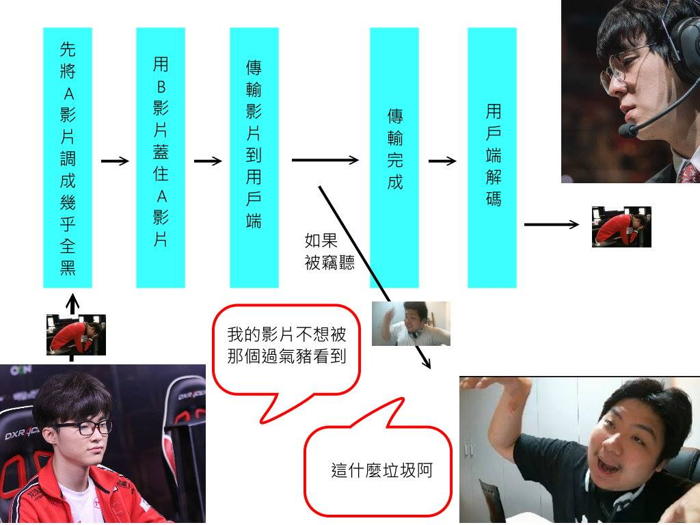

# Video-Faker

## Introduction
  在Client與Server溝通傳輸影片時，當影片內容涉及到機密內容時，安全的傳輸影片內容是一個關鍵的問題。目前最常看到的方式是讓使用者輸入密碼，Server收到正確的密碼才傳輸影片，但是網路層所用的tcp或是udp傳輸檔案都有可能被第三方軟體竊聽(例如Wireshark,Ethereal等)。既然在網路傳輸的封包被竊聽是無法避免的事，我們決定在應用層對影片作偽裝，使得第三方就算取得檔案封包，也無法立即判斷裡面有機密資料。

## Goal
  當Client跟Server請求A(Secret)影片時，Server會先拿B(non-secret)影片蓋住A影片在傳送回，Client端會有一個還原程式，還沒跑還原程式的時候，不管是Client或第三方看到的影片會是B影片；在Client端socket同時啟動還原程式，則User在畫面看到的就是被還原的畫面
  目標是做出一個看起來沒用的影片作為影片B，讓竊聽封包資訊的人認為這是不重要的資訊，而忽略此資訊，首先在心理上的狀態達到加密的效果。
  
## Target Users  
  
  
## Process

### 1. Steps
  
  
  當client端要求接收影片時，呈現的介面如上圖所示。首先輸入server端的IP Address，假設server 的IP Address 是140.112.253.33，則以相同的格式分別在四格內輸入140、112、253、33。接下來輸入對應的Port Number以及密碼，而這些資訊將會由server連同IP Address 事先一同告知。輸入完成後點選"檢查(Check)"驗證密碼。
  成功驗證密碼以後，將會顯示server端可以傳送的影片清單。選完欲傳送的影片後，即可選擇以Mode A，也就是影片加密的方法傳送影片。傳送完成後，點選Mode B 進行影片解密。解密完成後即可點選"View" 觀看影片。
  
## Implement
### 1. programming language
- **Python 3** (3.5 or newer)
-- [Anaconda](https://www.anaconda.com/what-is-anaconda/) is recommanded here for using [opencv](https://opencv.org) easily

### 2. Modules
#### for transport file
- socket(tcp/udp)
#### for video processing
- numpy
- opencv

## Reference
- 

## Time schedle
### (6/15) final project proposal
proposal 格式  
組員學號姓名  
主題  
簡介一下想達成什麼功能  
以組為單位繳交(一組一份)  
以一頁為限  
計入report分數  
請輸出成pdf檔上傳  
繳交期限6/15下午一點前  
遲交會斟酌扣分
