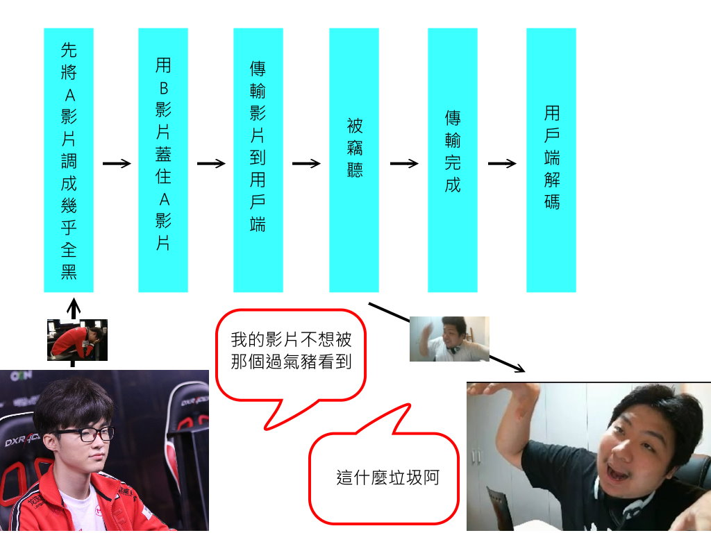

# Video-Faker

## Introduction
  傳輸影片時，有些內容不想讓外人偷看到，如果直接加密會顯得太明顯，所以選擇使用偽裝的方式包裝影片，讓偷看到的人以為是另外一個影片。

## Goal
  做出一個看起來沒用的影片，讓拿到的人認為這是不重要的資訊，直接忽略他。
  
## Target Users  
  
  
## Process
  

## Implement
### 1. programming language
- **Python 3** (3.5 or newer)
-- [Anaconda](https://www.anaconda.com/what-is-anaconda/) is recommanded here for using [opencv](https://opencv.org) easily

### 2. Modules
#### for transport file
- socket(tcp/udp)
#### for video processing
- numpy
- opencv

## Reference
- 

## Time schedle
### (6/15) final project proposal
proposal 格式  
組員學號姓名  
主題  
簡介一下想達成什麼功能  
以組為單位繳交(一組一份)  
以一頁為限  
計入report分數  
請輸出成pdf檔上傳  
繳交期限6/15下午一點前  
遲交會斟酌扣分
